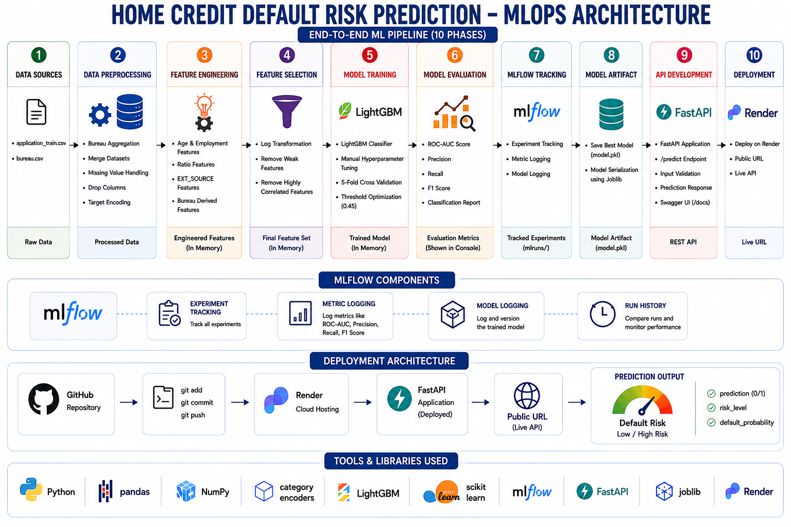

# Home Credit Default Risk Prediction

## Project Overview

This project predicts whether a customer is likely to default on a loan using the Home Credit Default Risk dataset from Kaggle.

The project follows an end-to-end Machine Learning and MLOps workflow including:

* Data Preprocessing
* Feature Engineering
* Feature Selection
* Model Training
* Hyperparameter Tuning
* MLflow Experiment Tracking
* Pipeline Automation
* API Development
* Cloud Deployment
* Git Version Control

---

## Live API Deployment

Hosted FastAPI Swagger Documentation:

https://home-credit-default-risk-api-tz8o.onrender.com/docs

---

## Dataset

**Dataset:** Home Credit Default Risk Dataset

**Files Used:**

* `application_train.csv`
* `bureau.csv`

**Source:** Kaggle - Home Credit Default Risk

---

## Project Structure

```text
home-credit-default-risk-pred/

├── images/
│   └── architecture_diagram.png
│
├── data/
│   ├── application_train.csv
│   ├── bureau.csv
│   ├── preprocessed_data.csv
│
├── models/
│   └── model.pkl
│
├── src/
│   ├── preprocessing.py
│   ├── feature_engineering.py
│   ├── feature_selection.py
│   ├── train_model.py
│   ├── api.py
│   └── main.py
│
├── mlruns/
│
├── README.md
├── requirements.txt
└── .gitignore
```

---

## Architecture Diagram

<p align="center">
  
</p>

---

## Workflow

### 1. Data Preprocessing

* Load datasets
* Bureau data aggregation
* Dataset merging
* Missing value handling
* Target encoding
* Feature cleanup

### 2. Feature Engineering

Created features include:

* AGE
* YEARS_EMPLOYED
* EMPLOYED_BIRTH_RATIO
* GOODS_INCOME_RATIO
* CREDIT_INCOME_RATIO
* ANNUITY_INCOME_RATIO
* PAYMENT_RATE
* GOODS_CREDIT_RATIO
* EXT_SOURCE_RANGE
* EXT_MEAN
* EXT_STD
* EXT_MIN
* EXT_MAX
* EXT_SUM
* BUREAU_DEBT_RATIO
* BUREAU_OVERDUE_RATIO

### 3. Feature Selection

* Weak feature removal
* Highly correlated feature removal

### 4. Model Training

**Algorithm Used**

* LightGBM Classifier

**Cross Validation**

* 5-Fold Cross Validation

**Evaluation Metrics**

* ROC-AUC Score
* Precision
* Recall
* F1 Score

### 5. MLflow Tracking

MLflow was used for:

* Experiment Tracking
* Metric Logging
* Model Logging

Tracked Metrics:

* ROC-AUC
* Precision
* Recall
* F1 Score

---

## Running the Pipeline

### Activate Virtual Environment

```bash
venv\Scripts\activate
```

### Run Training Pipeline

```bash
python src/main.py
```

### Output

* Preprocessed Data
* Trained Model
* MLflow Logs
* Saved Model File

---

## Running the API Locally

### Start FastAPI Server

```bash
uvicorn src.api:app --reload
```

### Open Swagger Documentation

```text
http://127.0.0.1:8000/docs
```

---

## API Endpoint

### POST `/predict`

Predicts customer default risk using input customer data.

### Response Example

```json
{
    "prediction": 0,
    "risk_level": "LOW RISK",
    "default_probability": 0.1234
}
```

---

## Technologies Used

* Python
* Pandas
* NumPy
* Scikit-Learn
* LightGBM
* MLflow
* FastAPI
* Joblib
* Git
* GitHub
* Render

---

## Deployment

* Backend Framework: FastAPI
* Cloud Platform: Render
* Model Serialization: Joblib


